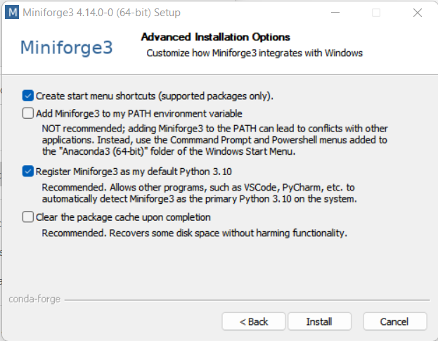
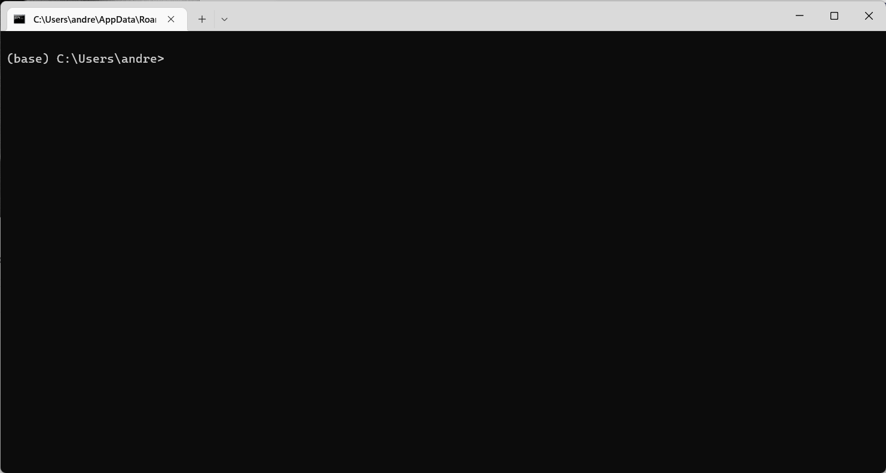
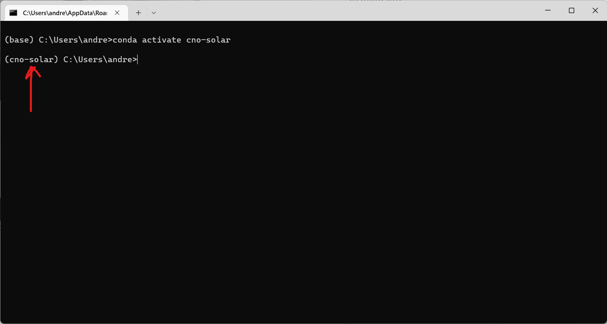

# cnosolar


 
## Introducción

#### Acuerdo Específico 5: Convenio Marco CNO-Uniandes

Protocolos para el cálculo de la CEN (Capacidad Efectiva Neta) y el modelo que relaciona el recurso y la potencia para plantas solares fotovoltaicas a partir de modelamiento computacional.

#### Objetivos

1. Desarrollar la metodología para la estimación y modelamiento de la Irradiancia Normal Directa (*Direct Normal Irradiance* – DNI), la Irradiancia Horizontal Difusa (*Diffuse Horizontal Irradiance* – DHI) y la irradiancia sobre el plano del arreglo (*Plane-of-Array* – POA) a partir de la Irradiancia Horizontal Global (*Global Horizontal Irradiance* – GHI).
2. Desarrollar protocolo para el cálculo de la CEN de plantas solares fotovoltaicas antes de su entrada en operación.
3. Desarrollar el modelo que relaciona el recurso y la potencia en plantas solares fotovoltaicas. El modelo permitirá obtener la producción de la planta a partir de los parámetros técnicos de la planta (configuración, tecnologías, tipo de seguimiento, entre otros aspectos), la irradiancia y otras variables meteorológicas.

## Documentación

#### Protocolos
Los protocolos se encuentran en la carpeta [`Protocolos`](https://git.cno.org.co/cno/cno_solar/-/tree/main/Protocolos). 

#### Memoria de Cálculos
En la carpeta [`Memoria_de_Calculos`](https://git.cno.org.co/cno/cno_solar/-/tree/main/Memoria_de_Calculos) se encuentra la documentación correspondiente a las pruebas de concepto de las metodologías recomendadas, validación con datos disponibles de la planta fotovoltaica del Edificio Santo Domingo de la Universidad de los Andes y estimación de los errores e incertidumbres.

#### Ejemplos
En la carpeta [`examples`](https://git.cno.org.co/cno/cno_solar/-/tree/main/examples) se encuentra el documento `CNO_Doc_Ejemplos.pdf`. Allí se presentan tres ejemplos de arquitecturas de plantas fotovoltaicas para la ejecución completa del repositorio `cnosolar`. Cada ejemplo dispone de una carpeta en la cual se alojan los archivos necesarios para la ejecución, así como los resultados de la misma.

#### Descargas
La descarga de los archivos de configuración de la planta fotovoltaica (cuaderno `CNO_Configuracion_Sistema.ipynb`) se alojan en la carpeta `configurations`. 

La descarga de los archivos de producción y de las gráficas (cuaderno `CNO_Protocolos.ipynb`) se alojan en la carpeta `downloads`.

## Instalación

#### Repositorio

Primero es necesario descargar los archivos de los protocolos y los aplicativos para la creación de los archivos de configuración y para correr los modelos. Los archivos se encuentran alojados en el repositorio del Consejo Nacional de Operación en [cno/cno_solar](https://git.cno.org.co/cno/cno_solar). Para [clonar](https://docs.github.com/es/repositories/creating-and-managing-repositories/cloning-a-repository) el repositorio `cnosolar` se recomienda usar el software [GitHub Desktop](https://desktop.github.com/). 

Una vez haya descargado e instalado *Github Desktop*, seleccione *File* y *Clone Repository...*. En la pestaña *URL*, en el campo *URL or username/repository* escriba la dirección `https://git.cno.org.co/cno/cno_solar.git`. Seleccione la ubicación donde quiere descargar los archivos y seleccione *Clone*. 

#### Distribución y Ambiente

Se recomienda instalar [Miniforge](https://github.com/conda-forge/miniforge) como ambiente para instalar Python y las librerías necesarias para la ejecución de los protocolos. Miniforge es una distribución de Python y el administrador de paquetes `conda`, permite fácilmente la configuración de ambientes y la instalación de paquetes desde el repositorio `conda-forge`.

Durante la instalación utilice las opciones recomendadas en las `Advanced Installation Options` como se muestra a continuación.



Luego de descargar e instalar `Miniforge`, inicie el terminal mediante la aplicación `Miniforge Prompt`. Si la instalación se realizó de manera correcta, debe estar en el ambiente `(base)` como se muestra a continuación. 



Se creará un ambiente específico para correr los protocolos, el cual llamaremos `cno-solar`, y se instalarán los paquetes necesarios. Con este fin abra un terminal con la aplicación `Miniforge Prompt` y desde el ambiente `(base)` **muévase al directorio donde tiene descargado los archivos del protocolo**, por ejemplo, si los tiene descargados en el escritorio:

```terminal
cd C:\usuario\Desktop\cno_solar
```

Luego cree el ambiente con el comando:

```terminal
conda env create --file environment.yml
```
Ahora, se activa dicho ambiente:

```terminal
conda activate cno-solar
```

Después de ejecutar el comando anterior, se debe estar en el ambiente correspondiente, en este caso denotado por `(cno-solar)` como se muestra en la siguiente figura.



Ahora se instala el kernel correspondiente al ambiente recien creado.

```terminal
python -m ipykernel install --user --name cno-solar --display-name "cno-solar"
```

Finalmente, ejecute el siguiente comando para iniciar los cuadernos. 

```terminal
jupyter notebook
```

Si desea eliminar el ambiente creado, ejecute el siguiente comando:

```terminal
conda env remove -n cno-solar
```

Luego, para eliminar el kernel `cno-solar` creado, ejecute el siguiente comando:

```terminal
jupyter kernelspec remove cno-solar
```

## Licencia

GNU AFFERO GENERAL PUBLIC LICENSE v3.0, dispuesta en el archivo `LICENSE`.
